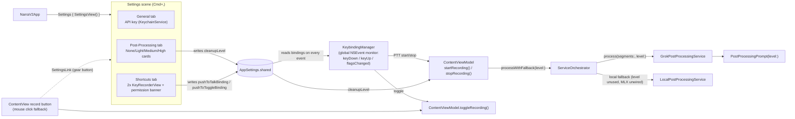

# NarraV2 — Fix Restart Crash, Add Settings Scene, Configurable Cleanup & Global Push-to-Talk/Toggle

## Context

Narra is a SwiftUI macOS dictation app (`swift-tools-version: 6.0`, `.macOS(.v14)`) that captures mic audio, transcribes it (Grok cloud / local Whisper fallback via `ServiceOrchestrator`), and cleans the transcript with an LLM. Today:

- Re-recording (stop, then start again) crashes because `AudioCaptureManager` reuses a single `AVAudioEngine` instance across sessions — a known source of instability when a tap is reinstalled on a previously-stopped engine.
- There's no real macOS `Settings` scene — preferences live in a floating `SettingsPanel` overlay toggled by `@State` in `ContentView`, exposing only the xAI API key and static model labels.
- Post-processing "cleanup strength" is hardcoded to one fixed prompt; the user wants a None/Light/Medium/High picker (like a reference design they have).
- Recording is only toggled by a hardcoded ⌘R while the app is focused. The user wants two new, independently-configurable, **system-wide** gestures: **push-to-talk** (hold a key, record while held, default **fn**) and **push-to-toggle** (press once, toggle recording, default **fn+Space**) — both live simultaneously, no mode switch.

This plan fixes the crash, adds a `Settings` scene with API-key/cleanup-level/shortcuts tabs, threads the chosen cleanup level through the existing Grok post-processing pipeline, replaces the hardcoded ⌘R with the two configurable global commands, and polishes `ContentView` — reusing existing patterns (`KeychainService`/`GrokAPIKeySource`, the `ServiceOrchestrator` fallback design, the `LiquidGlass*` material helpers, the project's existing `@unchecked Sendable` convention for classes that bridge into closures) rather than inventing new ones.

**Sandbox caveat:** this container has no Swift toolchain and no macOS frameworks (`swift: command not found`, Linux host). I cannot run `swift build`/`swift test` or launch the app here. I will keep edits self-consistent by tracing every call site by hand, but the final `swift build && swift test` and an in-app smoke test must happen on the user's Mac after the PR is up.

**Known limitation (flagging now, not silently glossing over it):** global keyboard monitoring (`NSEvent.addGlobalMonitorForEvents`) requires the user to grant **Input Monitoring** access in System Settings → Privacy & Security. This permission is tracked by macOS against the app's bundle identity, and this repo currently ships as a bare SwiftPM executable with **no `Info.plist`/`.app` bundle** — there's no existing packaging step anywhere in the repo (confirmed: no `.plist`, `.entitlements`, or build/bundling script exists today; mic permission already rides on whatever ad hoc identity `swift run`/the built binary gets). I'll write the permission-check/request code so it's correct once the app is properly bundled and signed, and surface a clear in-app prompt — but reliably appearing in the Input Monitoring list may need real `.app` packaging, which is out of scope here unless you want me to add it.

---

## 1. Fix the Command+R restart crash

**File:** `Sources/NarraV2/Audio/AudioCaptureManager.swift`

- Change `private let engine = AVAudioEngine()` → `private var engine = AVAudioEngine()`.
- In `start()`, right after the permission-granted guard (before reading `engine.inputNode`), assign a fresh instance: `engine = AVAudioEngine()`. By this point `stop()` has already torn down the previous engine (`removeTap` + `engine.stop()`), so the old instance is safely discarded and a clean engine/tap is installed every session instead of reusing one that's already been stopped once.
- No other changes needed — `stop()`, `clearBuffer()`, and the tap/converter logic already read `engine` as an instance property.

`AudioCaptureManagerTests.swift` doesn't call `start()`, so no test changes needed.

---

## 2. `AppSettings` model (new)

**File:** `Sources/NarraV2/Models/AppSettings.swift` (new)

```swift
enum CleanupLevel: String, CaseIterable, Codable, Sendable, Identifiable {
    case none, light, medium, high
    var id: String { rawValue }
    var title: String { ... }        // "None", "Light", "Medium", "High"
    var description: String { ... }  // one-line description per level
    var example: String { ... }      // short illustrative line for the card
}

/// A key combo that may be modifier-only (`keyChar == nil`, e.g. bare `fn`)
/// or a character key plus modifiers (e.g. `fn` + Space).
struct KeyBinding: Codable, Equatable {
    var keyChar: String?     // single-character string, or nil for modifier-only
    var modifierFlags: UInt  // NSEvent.ModifierFlags raw value; may include .function

    var displayString: String { ... }  // "fn", "fn Space", "⌘⇧R", etc.
}

final class AppSettings: ObservableObject {
    static let shared = AppSettings()

    @Published var cleanupLevel: CleanupLevel              // default .medium
    @Published var pushToTalkBinding: KeyBinding           // default: keyChar nil, modifiers = [.function]
    @Published var pushToToggleBinding: KeyBinding         // default: keyChar " ", modifiers = [.function]
    // each didSet persists itself (JSON-encoded KeyBinding / cleanupLevel.rawValue) to UserDefaults.standard
}
```

- New persistence — no existing UserDefaults usage in the codebase, but this mirrors the existing `@Published`/`ObservableObject` pattern already used by `ContentViewModel`.
- `KeyBinding` is intentionally generic (not fn-specific) so the recorder UI and matching logic in `KeybindingManager` (§4) have one code path for "modifier combo alone" and "modifier combo + key", instead of hardcoding fn as a special case throughout.

---

## 3. Thread `CleanupLevel` through post-processing

The `PostProcessingService` protocol (`process(segment:)` / `process(segments:)`) is called directly in existing tests (`PostProcessingServiceTests`, `GrokPostProcessingServiceTests`, `LocalServicesTests`) with no level argument — **don't change the protocol**. Add a level-aware entry point on the concrete Grok class only; keep the protocol methods as thin wrappers defaulting to `.medium` (today's behavior) so existing tests keep passing unmodified.

**`Sources/NarraV2/Services/PostProcessing/GrokPostProcessingService.swift`:**
- Remove the stored `private let prompt: PostProcessingPrompt` and its construction in `init`.
- `PostProcessingPrompt` gains `let level: CleanupLevel` and `init(level: CleanupLevel = .medium)`; `systemPrompt` becomes computed, switching on `level`:
  - `.none` → return the transcript unchanged, no edits.
  - `.light` → strip filler words / fix grammar only, no rephrasing.
  - `.medium` → **today's exact system prompt text**, so `test_systemPrompt_forbidsRephrasing` / `test_userPrompt_numbersSegments` (which construct `PostProcessingPrompt()`, defaulting to `.medium`) keep passing verbatim.
  - `.high` → condense/tighten aggressively, drop redundancy, prioritize brevity.
  - `userPrompt(for:)` is unchanged (level-independent).
- Add `public func process(segments: [TranscriptSegment], level: CleanupLevel) async throws -> ProcessedTranscript` — same body as today's `process(segments:)` but builds `PostProcessingPrompt(level: level)` locally.
- The two protocol methods become one-line wrappers calling the new method with `level: .medium`.

**`Sources/NarraV2/Services/Orchestrator/ServiceOrchestrator.swift`:**
- `processWithFallback(_ segments:)` / `processWithFallback(_ segment:)` gain a required `level: CleanupLevel` param. Cloud branch calls `cloudProcessor.process(segments:level:)`; local-fallback branch keeps calling `localProcessor.process(segments:)` unchanged (MLX inference is unwired today — `LocalPostProcessingService.runMLX` always throws "not yet wired" — so cleanup level has no functional local target yet).
- `ContentViewModel.stopRecording` is the only caller and no test calls `processWithFallback` directly, so changing the signature (not adding a default) is safe.

**`Sources/NarraV2/ContentViewModel.swift`:**
- `stopRecording()`: `try await orchestrator.processWithFallback(segment, level: AppSettings.shared.cleanupLevel)`.
- Read `orchestrator.pickOrder()` (already `internal`, visible within the module) right before calling, and publish `@Published var pipelineText: String` like `"Whisper · Grok (\(level.title))"` or `"Whisper · Local LLM"` for the UI polish in §6. This reflects the orchestrator's selection at call time, not a post-hoc "what actually ran after fallback" — good enough for a status strip without changing `ServiceOrchestrator`'s return types.
- Add idempotency guards: `startRecording()` becomes a no-op if `isRecording` is already `true`; `stopRecording()` becomes a no-op if `isRecording` is already `false`. Today neither guards, and `startRecording()` overwrites `captureTask` without cancelling a prior one — harmless today because only one button can call it, but the new global push-to-talk path (§4) can plausibly deliver a stray double key-down or a key-up with no matching key-down, so both entry points need to be safe to call redundantly.

---

## 4. Global push-to-talk / push-to-toggle (`KeybindingManager`)

SwiftUI's `.keyboardShortcut` cannot express "hold to start, release to stop," and `fn` isn't a regular key at all — it only ever appears as a modifier-flag transition on `NSEvent.flagsChanged` (there's no `keyDown` for fn alone). Both requirements mean this needs a real `NSEvent` monitor, and per your answer it must be a **global** monitor so it works while another app is focused, not a local one scoped to Narra's window.

**File:** `Sources/NarraV2/Services/KeybindingManager.swift` (new)

```swift
@unchecked Sendable   // matches the existing convention (AudioCaptureManager, ServiceOrchestrator,
                       // GrokPostProcessingService are all `final class ... : @unchecked Sendable`);
                       // AppKit delivers global keyboard monitor callbacks on the main thread in practice.
final class KeybindingManager {
    static let shared = KeybindingManager()

    var onPushToTalkStart: (() -> Void)?
    var onPushToTalkStop: (() -> Void)?
    var onPushToToggle: (() -> Void)?

    func start() { /* IOHIDRequestAccess(.listenEvent), then addGlobalMonitorForEvents(matching: [.keyDown, .keyUp, .flagsChanged]) */ }
    func stop() { /* NSEvent.removeMonitor */ }
    var hasInputMonitoringAccess: Bool { /* IOHIDCheckAccess(.listenEvent) == .granted */ }
}
```

- Permission: call `IOHIDRequestAccess(kIOHIDRequestTypeListenEvent)` once before installing the monitor — same shape as `AudioCaptureManager.requestPermission()` calling `AVCaptureDevice.requestAccess`. Expose `hasInputMonitoringAccess` (via `IOHIDCheckAccess`) for the Settings UI to show a banner + "Open System Settings" button (deep link: `NSWorkspace.shared.open(URL(string: "x-apple.systempreferences:com.apple.preference.security?Privacy_ListenEvent")!)`) when not granted.
- Matching: a `KeyBinding` matches a `.keyDown`/`.keyUp` event when `event.charactersIgnoringModifiers?.lowercased() == binding.keyChar` and the event's relevant modifier flags equal `binding.modifierFlags`. A modifier-only `KeyBinding` (`keyChar == nil`) matches `.flagsChanged` transitions of that exact flag set — track the previously-seen flags in an ivar so each `.flagsChanged` event can be classified as a rising or falling edge for the bits in `binding.modifierFlags`.
- Dispatch, using the two bindings from `AppSettings.shared` read fresh on every event (so changes in the Shortcuts tab take effect immediately, no restart):
  - **Push-to-talk**: rising edge (modifier-only) or `keyDown` (char binding, ignore `event.isARepeat`) → `onPushToTalkStart?()`. Falling edge / matching `keyUp` → `onPushToTalkStop?()`.
  - **Push-to-toggle**: rising edge / `keyDown` (ignore repeats) → `onPushToToggle?()`. No action on release.
- Wiring: in `ContentView`, on `.task` (or `.onAppear`), set:
  ```swift
  KeybindingManager.shared.onPushToTalkStart = { viewModel.startRecording() }
  KeybindingManager.shared.onPushToTalkStop  = { viewModel.stopRecording() }
  KeybindingManager.shared.onPushToToggle    = { viewModel.toggleRecording() }
  KeybindingManager.shared.start()
  ```
  This is safe with the single-window architecture (one `ContentViewModel` instance for the app's lifetime).
- Remove the record button's `.keyboardShortcut("r", modifiers: .command)` entirely — keyboard-triggered start/stop now goes exclusively through `KeybindingManager`; the button's mouse-click `viewModel.toggleRecording()` action stays as the fallback if Input Monitoring isn't granted.

### Capturing bindings: `KeyRecorderView`

**File:** `Sources/NarraV2/Views/KeyRecorderView.swift` (new)

`NSViewRepresentable` wrapping an `NSView` subclass (`acceptsFirstResponder = true`). Click → become first responder, enter a "recording" visual state ("Press a key, or hold a modifier and release…"). While recording:
- Track the peak modifier flags seen via `flagsChanged`.
- On `keyDown`: guard `event.charactersIgnoringModifiers?.first` is non-nil (ignore dead keys / events with no resolvable character) and commit `KeyBinding(keyChar: String(char).lowercased(), modifierFlags: event.modifierFlags relevant bits)`.
- On `flagsChanged` where flags drop back to empty after having been non-empty (i.e. the user held a modifier and let go without pressing a character key): commit `KeyBinding(keyChar: nil, modifierFlags: peakFlags)` — this is how "fn" alone gets captured.
- Either commit path exits recording state and writes straight to the bound `AppSettings` property (passed in as a closure/binding from `SettingsView`).
- Displays the current binding via `KeyBinding.displayString`.

---

## 5. `Settings` scene + window

**File:** `Sources/NarraV2/Views/SettingsView.swift` (new)

`TabView` with three tabs:

1. **"General"** — xAI API key `SecureField` + Save + "Key saved ✓" feedback, plus the static Speech/Language model labels. Lifted straight out of the `SettingsPanel` struct being deleted from `ContentView.swift` (same `KeychainService.save` / `GrokAPIKeySource.resolve()` calls) so that functionality isn't lost.
2. **"Post-Processing"** — cleanup level picker: header card (gradient) explaining auto-cleanup applies to all dictations and the original is preserved; four horizontal cards (one per `CleanupLevel.allCases`) with title/description/italic lavender-tinted example block, selection bound to `AppSettings.shared.cleanupLevel`, styled with the existing `RoundedRectangle` + `.ultraThinMaterial`/`glassEffect` look from `LiquidGlassView.swift`; static footer describing the pipeline (not network-dependent — that would need sharing a `ServiceOrchestrator` instance across scenes, not needed here).
3. **"Shortcuts"** —
   - A permission banner when `!KeybindingManager.shared.hasInputMonitoringAccess`: "Narra needs Input Monitoring access for global shortcuts" + "Open System Settings" button.
   - Row "Push-to-Talk (hold)" with a `KeyRecorderView` bound to `AppSettings.shared.pushToTalkBinding`.
   - Row "Push-to-Toggle (press)" with a `KeyRecorderView` bound to `AppSettings.shared.pushToToggleBinding`.
   - Read-only reference row "⌘⇧C — Copy transcript" (unaffected local shortcut, left as-is).

**`Sources/NarraV2/NarraV2App.swift`:**
- Add `Settings { SettingsView() }` as a second scene — macOS wires this to the app menu's "Settings…" item with ⌘, automatically. No custom `CommandGroup` needed.

---

## 6. `ContentView` cleanup + polish

**File:** `Sources/NarraV2/ContentView.swift`

- Delete the `SettingsPanel` struct and the `@State private var isShowingSettings` / overlay block — superseded by the `Settings` scene.
- Replace the gear `Button` with `SettingsLink { Image(systemName: "gearshape.fill").font(.title2) }` (macOS 14+ API, matches the deployment target); drop its `.keyboardShortcut(",")` (the `Settings` scene already provides ⌘,).
- Remove `.keyboardShortcut("r", modifiers: .command)` from the record button (superseded by `KeybindingManager`, §4); wire `KeybindingManager.shared` callbacks via `.task`.
- Header: keep `StatusIndicator`, add `viewModel.pipelineText` as a small secondary badge.
- Transcript area: placeholder styling (mic glyph + "Transcription will appear here…") for the empty state; slightly larger body text.
- Record control: larger, centered pill button below the transcript (red fill while recording), replacing the small toolbar glyph as the one obvious place to start/stop by mouse.
- Wrap `isRecording`/`statusText`/`pipelineText` transitions in `withAnimation(.spring())`.

---

## Dependency / data flow



---

## Files changed / created

| Action | File |
|--------|------|
| Modify | `Sources/NarraV2/Audio/AudioCaptureManager.swift` |
| Modify | `Sources/NarraV2/NarraV2App.swift` |
| Modify | `Sources/NarraV2/ContentView.swift` |
| Modify | `Sources/NarraV2/ContentViewModel.swift` |
| Modify | `Sources/NarraV2/Services/PostProcessing/GrokPostProcessingService.swift` |
| Modify | `Sources/NarraV2/Services/Orchestrator/ServiceOrchestrator.swift` |
| Create | `Sources/NarraV2/Models/AppSettings.swift` |
| Create | `Sources/NarraV2/Services/KeybindingManager.swift` |
| Create | `Sources/NarraV2/Views/SettingsView.swift` |
| Create | `Sources/NarraV2/Views/KeyRecorderView.swift` |

No changes to `PostProcessingService.swift`, `LocalPostProcessingService.swift`, or any test file are required; existing tests should keep passing since `PostProcessingPrompt()`'s default level (`.medium`) preserves today's exact system prompt text.

---

## Verification

1. Static check: re-read every edited file after writing it, confirm signatures line up end-to-end (`KeybindingManager` → `ContentViewModel` → `ServiceOrchestrator` → `GrokPostProcessingService`), since I cannot compile here (no Swift toolchain / macOS frameworks in this Linux sandbox).
2. Hand-trace existing tests against the new code (`GrokPostProcessingServiceTests`, `PostProcessingServiceTests`, `LocalServicesTests`, `AudioCaptureManagerTests`) to confirm none need edits.
3. After pushing, run on macOS: `swift build` then `swift test`.
4. Manual smoke test on macOS: launch, record, stop, record again (original crash repro) — must not crash. Grant Input Monitoring when prompted; hold fn from another app and confirm recording starts/stops with the hold; press fn+Space from another app and confirm it toggles recording on/off. Open Settings via ⌘, and via the gear icon; switch cleanup level and confirm a dictation reflects the new prompt; rebind both shortcuts in the Shortcuts tab (including capturing a modifier-only binding) and confirm the new combos work while the old defaults no longer do.
